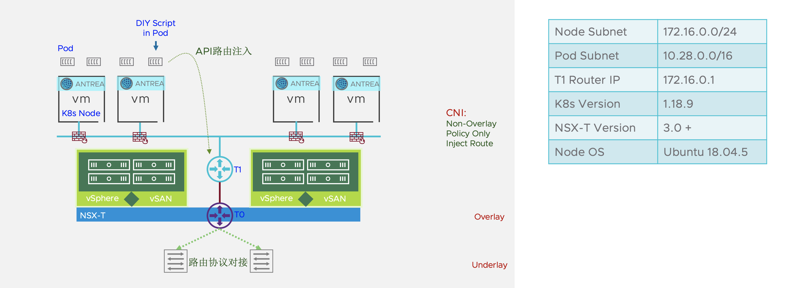

# Route2Nsx

## Overview
This script is only suitable for injecting static routes into a single T1 Router in NSX-T.<br>
The script reads the relationship between Node IP and Pod Subnet in the K8s cluster, Generate a static route in Json format, and update the API to the specified T1 Router.<br>
`This script is purely a personal hobby, it needs to be used with caution in other environments.`

 

## Usage
You can run the script as a Docker or as a Pod in the K8s cluster.<br>
Specify T1 Router ID(Name), NSX-T Username & Password by passing environment variables.<br>
To use Docker, you need to mount a permissioned Kubeconfig.<br>

* Docker Run:
```
docker run --name route2nsx \
-e NSXMANAGER_IP=192.168.31.245 \
-e T1ROUTER_ID=K8C3-T1 \
-e NSX_USER=admin \
-e NSX_PASSWD="VMware1\!VMware1\!" \
-v ~/.kube/config:/root/.kube/config \
rock981119/route2nsx:unity.v1
```
<br>
* Pod in Cluster
```
apiVersion: v1
kind: ServiceAccount
metadata:
  name: route2nsx-sa
  namespace: default
---
apiVersion: rbac.authorization.k8s.io/v1
kind: ClusterRole
metadata:
  name: route2nsx-sa-get-node
rules:
- apiGroups:
  - ""
  resources:
  - nodes
  verbs:
  - get
  - list
---
apiVersion: rbac.authorization.k8s.io/v1
kind: ClusterRoleBinding
metadata:
  name: route2nsx-sa-get-node-rb
roleRef:
  apiGroup: rbac.authorization.k8s.io
  kind: ClusterRole
  name: route2nsx-sa-get-node
subjects:
- kind: ServiceAccount
  name: route2nsx-sa
  namespace: default
---
apiVersion: v1
kind: Pod
metadata:
  labels:
    run: route2nsx
  name: route2nsx
spec:
  hostNetwork: true
  serviceAccountName: route2nsx-sa
  containers:
  - image: rock981119/route2nsx:unity.v1
    name: route2nsx
    env:
    - name: NSXMANAGER_IP
      value: 192.168.31.245
    - name: T1ROUTER_ID
      value: K8C1-T1
    - name: NSX_USER
      value: admin
    - name: NSX_PASSWD
      value: VMware1!VMware1!
  dnsPolicy: ClusterFirst
  restartPolicy: Always
```
